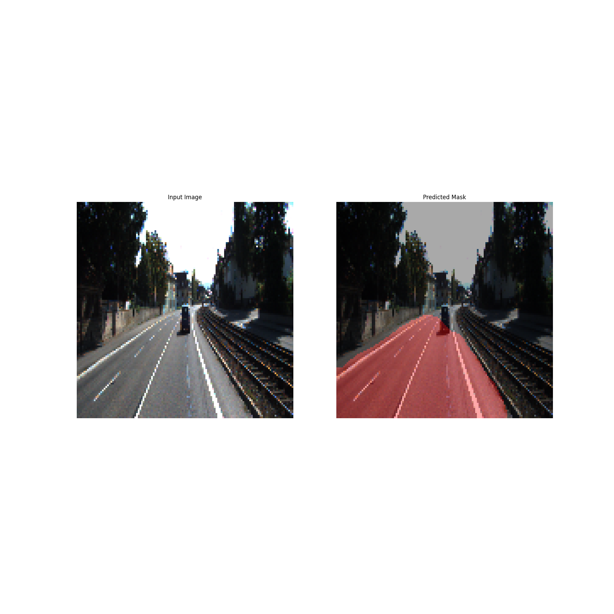

# Autonomous Vehicle Perception Stack

 <!-- Add a banner image later -->

A comprehensive perception stack for autonomous vehicles including road segmentation, object detection, tracking, and 3D visualization.

## 🚀 Features

- **Road Segmentation**: Semantic segmentation of drivable areas
- **Object Detection**: YOLO-based detection of vehicles, pedestrians, etc.
- **Object Tracking**: Deep SORT for multi-object tracking
- **3D Visualization**: KITTI dataset visualization tools
- **Multi-Task Learning**: MTAN for joint perception tasks
- **3D Detection**: SFA3D for 3D object detection
- **Bird's Eye View**: UNet-based top-view transformation

## 📂 Repository Structure

```bash
Autonomous-Vehicle-Perception/
├── data/                    # Datasets or links to datasets
├── notebooks/               # Jupyter notebooks for each sub-project
├── scripts/                 # Reusable Python scripts
├── visualizations/          # Output images, videos, or plots
├── docs/                    # Additional documentation
├── requirements.txt         # Python dependencies
├── README.md               # This file
├── LICENSE                 # MIT License
└── .gitignore              # Ignore unnecessary files
